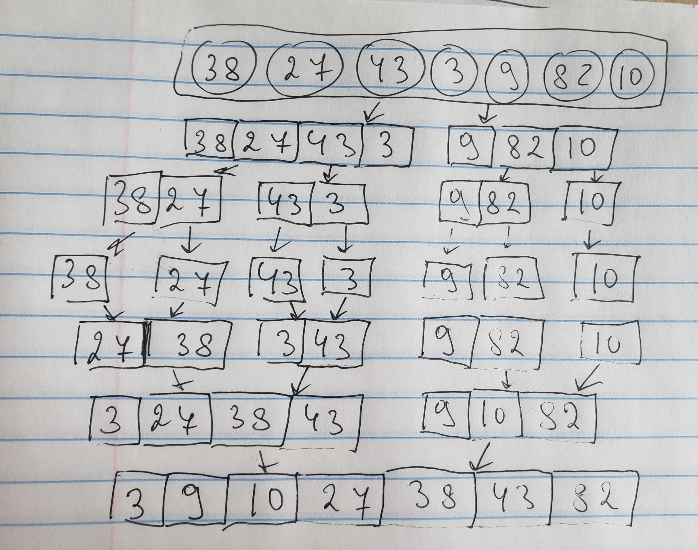

# Merge Sort



```
// Merges two already sorted arrays
function merge(left, right){
    let results = [];
    let l = 0;
    let r = 0;
    while(l < left.length && r < right.length){
        if(left[l] < right[r]){
            results.push(left[l]);
            l++;
        } else { // case if right[r] less or equal
            results.push(right[r]);
            r++;
        }
    }
    // as arrays length can be not equal,
    // but we for sure know that left and right are sorted
    // we simply add what's left at the end
    while(l < left.length) {
        results.push(left[l]);
        l++;
    }
    while(r < right.length) {
        results.push(right[r]);
        r++;
    }
    return results;
}

// Recursive Merge Sort
function mergeSort(arr){
    if(arr.length <= 1) return arr;
    let mid = Math.floor(arr.length/2);
    let left = mergeSort(arr.slice(0,mid)); // selected from start to end (end not included)
    let right = mergeSort(arr.slice(mid));
    return merge(left, right);
}

// tests
console.log(mergeSort([38, 27, 43, 3, 9, 82, 10])); // [3, 9, 10, 27, 38, 43, 82]

```
[more code](index.js)

## Big O

| Time Complexity(Best) | Time Complexity(Average) | Time Complexity(Worst) | Space Complexity |
| ------------- | ------------- | ------------- | ------------- |
| O(n log n)    | O(n log n)    | O(n log n)    | O(n)          |

### Explanation 
 **O(n log n)**
* O(log n) - decompositions ***How much we divide initial array***
* O(n) - comparisons per decomposition ***At the end we have N arrays with one element. And we compare them***

### Resources
* [bigocheatsheet.com](http://bigocheatsheet.com/)
