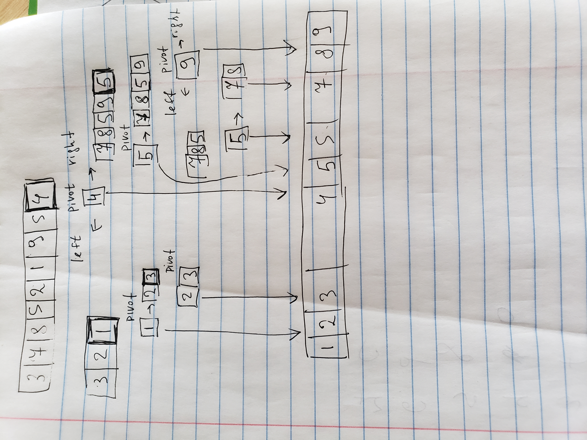

```
function quickSort(nums) {
    if (nums.length < 2) {
        return nums;
    }

    const pivot = nums[nums.length-1];
    let left = [];
    let right = [];

    for (let i = 0; i < nums.length-1; i++) {
        if (nums[i] < pivot) {
            left.push(nums[i]);
        } else {
            right.push(nums[i]);
        }
    }

    return [...quickSort(left), pivot, ...quickSort(right)];
}
```
[more code](index.js)

## Big O

| Time Complexity(Best) | Time Complexity(Average) | Time Complexity(Worst) | Space Complexity |
| ------------- | ------------- | ------------- | ------------- |
| O(n log n)    | O(n log n)    | O(n^2)    | O(log n)          |

## Explanation
### O(n log n)
* O(log n) - decompositions ***How much we divide initial array***
* O(n) - comparisons per decomposition ***At the end we have N arrays with one element. And we compare them***
### O(n^2)
* we have this if array already sorted


### Resources
* [bigocheatsheet.com](http://bigocheatsheet.com/)
